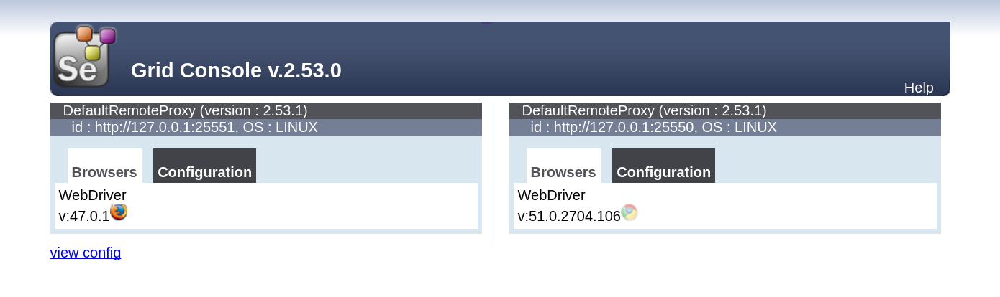

# Selenium in Docker with Chrome and Firefox

[](https://travis-ci.org/elgalu/docker-selenium)
[](https://gitter.im/elgalu/docker-selenium?utm_source=badge&utm_medium=badge&utm_campaign=pr-badge&utm_content=badge)

* selenium server grid with 2 nodes (chrome & firefox)
* mkv video recording
* VNC access (useful for debugging the container)
* google-chrome-stable
* google-chrome-beta: no longer provided but [can still be found here][2.47.1m]
* google-chrome-unstable: no longer provided but [can still be found here][2.47.1m]
* firefox stable latest
* firefox stable [last 18 versions can be found here][2.47.1m]
* fluxbox or openbox (lightweight window managers)



<h2 id="official">Notes on the official repo</h2>

Note [SeleniumHQ/docker-selenium](https://github.com/SeleniumHQ/docker-selenium) project is more useful for building selenium grids while this one focuses on building disposable standalone seleniums with [video recording support](./docs/videos.md) and both browsers on the same container. It also adds some other features like [customizing the screen size](#screen-size) and [ssh access](#ssh) that can be particularly useful for tunneling support.

### Purpose

The purpose of this project is to have [Selenium][] running as simple and as fast as possible.

<h2 id="run"> Run</h2>

1. Pull the image and run the container

        docker pull elgalu/selenium:2.53.0l

        docker run --rm -ti --name=grid -p 4444:24444 -p 5900:25900 \
            -v /dev/shm:/dev/shm -e VNC_PASSWORD=hola elgalu/selenium:2.53.0l

2. Wait until the grid starts properly before starting the tests _(Optional but recommended)_

        docker exec grid wait_all_done 30s

After this, [Selenium][] should be up and running at `http://localhost:4444/wd/hub`. Open the url in your browser to confirm it is running.
If you are using Mac (OSX) or [Microsoft Windows](https://docs.docker.com/engine/installation/windows/) `localhost` won't work! Find out the correct IP through `boot2docker ip` or `docker-machine ip default`.

**Notes:**
 * Add `sudo` only if needed in your environment
 * Add `--privileged` or `-v /dev/shm:/dev/shm` if you really need it. For example when [Chrome crashes](https://github.com/elgalu/docker-selenium/issues/20) during your high gpu intensive tests.

#### Stop
Shutdown gracefully

    docker exec grid stop
    docker stop grid

### Parallel
This image is designed to run one test on each docker container but if you still want to run multiple tests in parallel on the same container you can still do so by increasing `MAX_INSTANCES` and `MAX_SESSIONS` which now [defaults](https://github.com/elgalu/docker-selenium/blob/2.53.0k/Dockerfile#L949) to 1.

        docker run --rm -ti --name=grid -p 4444:24444 -p 5900:25900 \
            -v /dev/shm:/dev/shm -e VNC_PASSWORD=hola \
            -e MAX_INSTANCES=20 -e MAX_SESSIONS=20 \
            elgalu/selenium:2.53.0l

### OSX
If you are in Mac, you need to get the correct IP of the docker machine. One of these two commands should work to get it:

    docker-machine ip default

or former:

    boot2docker ip

### SSH

You can also ssh into the machine as long as `SSH_AUTH_KEYS="$(cat ~/.ssh/id_rsa.pub)"` is correct.

    docker run --rm -ti --name=grid -p=4444:24444 -p=5900:25900 -p=22222:22222 \
      -e SSHD=true \
      -e SSH_AUTH_KEYS="$(cat ~/.ssh/id_rsa.pub)" \
      -v /dev/shm:/dev/shm elgalu/selenium:2.53.0l

Then

    ssh -p 22222 -o StrictHostKeyChecking=no application@localhost

Include `-X` in ssh command if you want to redirect the started GUI programs to your host, but for that you also need to pass `-e SSHD_X11FORWARDING=yes`

    docker run --rm -ti --name=grid -p=4444:24444 -p=5900:25900 -p=22222:22222 \
      -e SSHD=true -e SSHD_X11FORWARDING=yes \
      -e SSH_AUTH_KEYS="$(cat ~/.ssh/id_rsa.pub)" \
      -v /dev/shm:/dev/shm elgalu/selenium:2.53.0l

Then

    ssh -X -p 22222 -o StrictHostKeyChecking=no application@localhost
    echo $DISPLAY #=> localhost:10.0

That's is useful for tunneling, or else you can stick with `docker exec` to get into the instance with a shell:

    docker exec -ti grid bash

Supervisor exposes an http server but is not enough to bind the ports via `docker run -p`, so in this case you need to FWD ports with `ssh -L`

    ssh -p 22222 -o StrictHostKeyChecking=no -L localhost:29001:localhost:29001 application@localhost

### Screen size
You can set a custom screen size at docker run time by providing `SCREEN_WIDTH` and `SCREEN_HEIGHT` environment variables:

    docker pull elgalu/selenium:2.53.0l

    docker run -d --name=grid -p 4444:24444 -p 5900:25900 \
      -v /dev/shm:/dev/shm -e VNC_PASSWORD=hola \
      -e SCREEN_WIDTH=1920 -e SCREEN_HEIGHT=1480 \
      elgalu/selenium:2.53.0l

    docker exec grid wait_all_done 10s

    open vnc://:hola@localhost:5900

### Chrome flavor

This feature was available in previous versions, please go to [2.47.1m] to use it.

To configure which Chrome flavor you want to use (stable, beta, unstable), just pass `-e CHROME_FLAVOR=beta` to `docker run`. Default is `stable`.

### Firefox version

This feature was available in previous versions, please go to [2.47.1m] to use it.
To configure which Firefox version to use, first check available versions in the [CHANGELOG](./CHANGELOG.md). Then pass `-e FIREFOX_VERSION=38.0.6` to `docker run`. Default is the latest number of the available list.

<h3 id="video">Record Videos</h3>

Step by step guide at [docs/videos.md](./docs/videos.md)

If you create the container with `-e VIDEO=true` it will start recording a video through the vnc connection run upon start.
It is recommended to create first a local folder `videos` in your current directory, and mount the videos directory for
an easy transfer with `-v $(pwd)/videos:/videos`.

Once your tests are done you can either manually stop the recording via `docker exec grid /bin-utils/stop-video` where
*grid* is just the arbitrary container chosen name in `docker run` command. Or simply stop the container and that will stop the video recording automatically.

Relevant environment variables to customize it are:

    FFMPEG_FRAME_RATE=25
    VIDEO_FILE_NAME="test"
    VIDEO_FILE_EXTENSION=mkv
    FFMPEG_CODEC_ARGS=""

It is important to note that `ffmpeg` video recording takes an important amount of CPU usage, even more when a well compressed format like *mkv* is selected. You may want to delegate video recording through `vnc2swf-start.sh` to a separate server process and even delegate compression to a further step or to a cloud service like YouTube.

### VNC

When you don't specify a VNC password, a random one will be generated. That password can be seeing by grepping the logs:

    docker exec grid wait_all_done 30s
    #=> ... a VNC password was generated for you: ooGhai0aesaesh

You can connect to see what's happening

    open vnc://:ooGhai0aesaesh@localhost:5900

### noVNC

Disabled by default, [noVNC](https://github.com/kanaka/noVNC) provides a browser VNC client so you don't need to install a vnc viewer if you choose so. *Note:* we were using guacamole before.

Safari Browser already comes with a built-in vnc viewer so this feature is overkill and is disabled by default, just navigate to vnc://localhost:5900 in your Safari browser.

You need to pass the environment variable `-e NOVNC=true` in order to start the noVNC service and you will be able to open a browser at [localhost:6080](http://localhost:6080/vnc.html)

    docker run --rm -ti --name=grid -p 4444:24444 -p 5900:25900 \
      -v /dev/shm:/dev/shm -p 6080:26080 -e NOVNC=true \
      elgalu/selenium:2.53.0l

If the VNC password was randomly generated find out with

    docker exec grid wait_all_done 30s
    #=> ... a VNC password was generated for you: ooGhai0aesaesh

## Issues with Chrome

### Chrome crashed

If your tests crashes in Chrome you may need to increase shm size or simply start your container by sharing `-v /dev/shm:/dev/shm`

    docker run ... -v /dev/shm:/dev/shm

Alternatively you can increase it inside the container:

1. start docker in privileged mode: `docker run --privileged`
2. increase shm size from default 64mb to something bigger:

```sh
docker exec grid sudo umount /dev/shm
docker exec grid sudo mount -t tmpfs -o rw,nosuid,nodev,noexec,relatime,size=512M tmpfs /dev/shm
```

### Chrome not reachable or timeout after 60 secs
In CentOS and apparently since docker 1.10.0 is necessary to disable [sandbox mode](http://www.chromium.org/developers/design-documents/sandbox) through [--no-sandbox](http://peter.sh/experiments/chromium-command-line-switches/#no-sandbox) example client implementation.

The error comes along with this message while starting Chrome:

> Failed to move to new namespace: PID namespaces supported. Network namespace supported, but failed: errno = Operation not permitted

#### No Sandbox

    ChromeOptions options = new ChromeOptions();
    options.addArguments("--no-sandbox");

In Protrator

    capabilities: {
      browserName: 'chrome',
      chromeOptions: {
        args: ['--no-sandbox'],
      },
    },

However this is now the default of this image, see `CHROME_ARGS="--no-sandbox"` in the Dockerfile so don't be surprised to see the "Stability and security will suffer" banner when opening Chrome inside the container.

## Security

The docker images are built and pushed from [TravisCI](https://travis-ci.org/elgalu/docker-selenium/builds/123103275) for full traceability.

Do **NOT** expose your selenium grid to the outside world (e.g. in AWS), because Selenium does not provide auth. Therefore, if the ports are not firewalled malicious users will use [your selenium grid as a bot net](https://github.com/SeleniumHQ/docker-selenium/issues/147).

Put that firewall stuff aside, a file [scm-source.json](./scm-source.json) is included at the root directory of the generated image with information that helps to comply with auditing requirements to trace the creation of this docker image.

Note [scm-source.json](./scm-source.json) file will always be 1 commit outdated in the repo but will be correct inside the container.

This is how the file looks like:

```
cat scm-source.json #=> { "url": "https://github.com/elgalu/docker-selenium",
                          "revision": "8d2e03d8b4c45c72e0c73481d5141850d54122fe",
                          "author": "lgallucci",
                          "status": "" }
```

There are also additional steps you can take to ensure you're using the correct image:

### Option 1 - Check the Full Image Id

You can simply verify that image id is indeed the correct one.

    # e.g. full image id for tag 2.53.0l
    export IMGID="<<Please see CHANGELOG.md>>"
    if docker inspect -f='{{.Id}}' elgalu/selenium:2.53.0l |grep ${IMGID} &> /dev/null; then
        echo "Image ID tested ok"
    else
        echo "Image ID doesn't match"
    fi

### Option 2 - Use immutable image digests

Given docker.io currently allows to push the same tag image twice this represent a security concern but since docker >= 1.6.2 is possible to fetch the digest sha256 instead of the tag so you can be sure you're using the exact same docker image every time:

    # e.g. sha256 for tag 2.53.0l
    export SHA=<<Please see CHANGELOG.md>>
    docker pull elgalu/selenium@sha256:${SHA}

You can find all digests sha256 and image ids per tag in the [CHANGELOG](./CHANGELOG.md) so as of now you just need to trust the sha256 in the CHANGELOG. Bullet proof is to fork this project and build the images yourself if security is a big concern.

## Cloud Testing Platforms

### Sauce Labs
To open the Sauce Labs tunnel while starting the docker container pass in the arguments `-e SAUCE_TUNNEL=true -e SAUCE_USER_NAME=leo -e SAUCE_API_KEY=secret` that will also require the tunnel to open successfully, else the container will exit so you can be sure your tunnel is up and running before starting to test.

### BrowserStack
To open the BrowserStack tunnel while starting the docker container pass in the arguments `-e BSTACK_TUNNEL=true -e BSTACK_ACCESS_KEY=secret` that will also require the tunnel to open successfully, else the container will exit so you can be sure your tunnel is up and running before starting to test.

## Additional Uses

### Using Xephyr to redirect X to the docker host
Note the below method gives full access to the docker container to the host machine.

Host machine, terminal 1:

    sudo apt-get install xserver-xephyr
    export XE_DISP_NUM=12 SCREEN_WIDTH=2000 SCREEN_HEIGHT=1500
    Xephyr -ac -br -noreset -resizeable \
        -screen ${SCREEN_WIDTH}x${SCREEN_HEIGHT} :${XE_DISP_NUM}

Host machine, terminal 2:

    docker run --rm --name=ch -p=4444:24444 \
      -v /dev/shm:/dev/shm \
      -e SCREEN_WIDTH -e SCREEN_HEIGHT -e XE_DISP_NUM \
      -v /tmp/.X11-unix/X${XE_DISP_NUM}:/tmp/.X11-unix/X${XE_DISP_NUM} \
      elgalu/selenium:2.53.0l

Now when you run your tests instead of connecting. If docker run fails try `xhost +`

### Using free available ports and tunneling to emulate localhost testing
Let's say you need to expose 4 ports (3000, 2525, 4545, 4546) from your laptop but test on the remote docker selenium.
Enter tunneling.

```sh
# -- Common: Set some handy shortcuts.
# On development machine (target test localhost server)
SOPTS="-o StrictHostKeyChecking=no"
TUNLOCOPTS="-v -N $SOPTS -L"
TUNREVOPTS="-v -N $SOPTS -R"
# port 0 means bind to a free available port
ANYPORT=0

# -- Option 1. docker run - Running docker locally
# Run a selenium instance binding to host random ports
REMOTE_DOCKER_SRV=localhost
CONTAINER=$(docker run -d -p=0.0.0.0:${ANYPORT}:22222 -p=0.0.0.0:${ANYPORT}:24444 \
    -p=0.0.0.0:${ANYPORT}:25900 -e SCREEN_HEIGHT=1110 -e VNC_PASSWORD=hola \
    -e SSH_AUTH_KEYS="$(cat ~/.ssh/id_rsa.pub)" elgalu/selenium:2.53.0l

# -- Option 2.docker run- Running docker on remote docker server like in the cloud
# Useful if the docker server is running in the cloud. Establish free local ports
REMOTE_DOCKER_SRV=some.docker.server.com
ssh ${REMOTE_DOCKER_SRV} #get into the remote docker provider somehow
# Note in remote server I'm using authorized_keys instead of id_rsa.pub given
# it acts as a jump host so my public key is already on that server
CONTAINER=$(docker run -d -p=0.0.0.0:${ANYPORT}:22222 -e SCREEN_HEIGHT=1110 \
    -e VNC_PASSWORD=hola -e SSH_AUTH_KEYS="$(cat ~/.ssh/authorized_keys)" \
    elgalu/selenium:2.53.0l

# -- Common: Wait for the container to start
./host-scripts/wait-docker-selenium.sh grid 7s
json_filter='{{(index (index .NetworkSettings.Ports "22222/tcp") 0).HostPort}}'
SSHD_PORT=$(docker inspect -f='${json_filter}' $CONTAINER)
echo $SSHD_PORT #=> e.g. SSHD_PORT=32769

# -- Option 1. Obtain dynamic values like container IP and assigned free ports
json_filter='{{(index (index .NetworkSettings.Ports "24444/tcp") 0).HostPort}}'
FREE_SELE_PORT=$(docker inspect -f='${json_filter}' $CONTAINER)
json_filter='{{(index (index .NetworkSettings.Ports "25900/tcp") 0).HostPort}}'
FREE_VNC_PORT=$(docker inspect -f='${json_filter}' $CONTAINER)

# -- Option 2. Get some free ports in current local machine. Needs python.
# IMPORTANT: Go back to development machine
FREE_SELE_PORT=$(python -c 'import socket; s=socket.socket(); \
    s.bind(("", 0)); print(s.getsockname()[1]); s.close()')
FREE_VNC_PORT=$(python -c 'import socket; s=socket.socket(); \
    s.bind(("", 0)); print(s.getsockname()[1]); s.close()')
# -- Option 2. Tunneling selenium+vnc is necessary if using a remote docker
ssh ${TUNLOCOPTS} localhost:${FREE_SELE_PORT}:localhost:24444 \
    -p ${SSHD_PORT} application@${REMOTE_DOCKER_SRV} &
LOC_TUN_SELE_PID=$!
ssh ${TUNLOCOPTS} localhost:${FREE_VNC_PORT}:localhost:25900 \
    -p ${SSHD_PORT} application@${REMOTE_DOCKER_SRV} &
LOC_TUN_VNC_PID=$!
echo $FREE_SELE_PORT $FREE_VNC_PORT

# -- Common: Expose local ports so can be tested as 'localhost'
# inside the docker container
ssh ${TUNREVOPTS} localhost:3000:localhost:3000 \
    -p ${SSHD_PORT} application@${REMOTE_DOCKER_SRV} &
REM_TUN1_PID=$!
ssh ${TUNREVOPTS} localhost:2525:localhost:2525 \
    -p ${SSHD_PORT} application@${REMOTE_DOCKER_SRV} &
REM_TUN2_PID=$!
ssh ${TUNREVOPTS} localhost:4545:localhost:4545 \
    -p ${SSHD_PORT} application@${REMOTE_DOCKER_SRV} &
REM_TUN3_PID=$!
ssh ${TUNREVOPTS} localhost:4546:localhost:4546 \
    -p ${SSHD_PORT} application@${REMOTE_DOCKER_SRV} &
REM_TUN4_PID=$!
echo Option 1. Should show 4 ports when doing it locally
echo Option 2. Should show 6 ports when doing it remotely
echo $REM_TUN1_PID $REM_TUN2_PID $REM_TUN3_PID \
    $REM_TUN4_PID $LOC_TUN_SELE_PID $LOC_TUN_VNC_PID
# Use the container as if selenium and VNC were running locally
# thanks to ssh -L port FWD
google-chrome-stable \
    "http://localhost:${FREE_SELE_PORT}/wd/hub/static/resource/hub.html"
vncv localhost:${FREE_VNC_PORT} -Scaling=70% &
# Stop all the things after your tests are done
kill $REM_TUN1_PID $REM_TUN2_PID $REM_TUN3_PID \
    $REM_TUN4_PID $LOC_TUN_SELE_PID $LOC_TUN_VNC_PID
# if in Option 2. execute below commands inside docker
# provider machine `ssh ${REMOTE_DOCKER_SRV}`
docker stop ${CONTAINER}
docker rm ${CONTAINER}
```

## Step by step build

### 1. Build this image

If you git clone this repo locally, i.e. cd into where the Dockerfile is, you can:

    docker build -t="elgalu/docker-selenium:local" .

If you prefer to download the final built image from docker you can pull it, personally I always prefer to build them manually except for the base images like Ubuntu 14.04.2:

    docker pull elgalu/selenium:2.53.0l

### 2. Use this image

#### e.g. Spawn a container for Chrome testing:

    CH=$(docker run --rm --name=CH -p=127.0.0.1::24444 -p=127.0.0.1::25900 \
        -v /e2e/uploads:/e2e/uploads elgalu/docker-selenium:local)

*Note:* `-v /e2e/uploads:/e2e/uploads` is optional in case you are testing browser uploads on your WebApp, you'll probably need to share a directory for this.

The `127.0.0.1::` part is to avoid binding to all network interfaces, most of the time you don't need to expose the docker container like that so just *localhost* for now.

I like to remove the containers after each e2e test with `--rm` since this docker container is not meant to preserve state, spawning a new one is less than 3 seconds. You need to think of your docker container as processes, not as running virtual machines in case you are familiar with vagrant.

A dynamic port will be bound to the container ones, i.e.

    # Obtain the selenium port you'll connect to:
    docker port $CH 4444
    #=> 127.0.0.1:49155

    # Obtain the VNC server port in case you want to look around
    docker port $CH 25900
    #=> 127.0.0.1:49160

In case you have RealVNC binary `vnc` in your path, you can always take a look, view only to avoid messing around your tests with an unintended mouse click or keyboard.

    ./bin/vncview.sh 127.0.0.1:49160

#### e.g. Spawn a container for Firefox testing:

This command line is the same as for Chrome, remember that the selenium running container is able to launch either Chrome or Firefox, the idea around having 2 separate containers, one for each browser is for convenience, plus avoid certain `:focus` issues your WebApp may encounter during e2e automation.

    FF=$(docker run --rm --name=ff -p=127.0.0.1::24444 -p=127.0.0.1::25900 \
        -v /e2e/uploads:/e2e/uploads elgalu/docker-selenium:local)

#### How to get docker internal IP through logs

    CONTAINER_IP=$(docker logs sele10 2>&1 | grep "Container docker internal IP: " | sed -e 's/.*IP: //' -e 's/<.*$//')
    echo ${CONTAINER_IP} #=> 172.17.0.34

#### Look around

    docker images
    #=>

    REPOSITORY               TAG                 IMAGE ID            CREATED             VIRTUAL SIZE
    elgalu/docker-selenium   local               eab41ff50f72        About an hour ago   931.1 MB
    ubuntu                   14.04.2             d0955f21bf24        4 weeks ago         188.3 MB

### DNS

#### How to share the host DNS

By default `docker run` sets the DNS to Google ones *8.8.8.8 and 8.8.4.4* however you may need to use your own.

First attempt is to use `--dns` option, e.g.

    docker run --dns=1.1.1.1 --dns=1.1.1.2 <args...>

However this may not work for you and simply want to share the same DNS name resolution than the docker host machine, in which case you should use `--net=host` along with `--pid=host`

    docker run --net=host --pid=host <args...>

So `--pid=host` is included to avoid https://github.com/docker/docker/issues/5899 `sudo: unable to send audit message: Operation not permitted`

## Who is using docker-selenium?

* [Zalando](https://tech.zalando.com/blog/)
* [Shoov](http://www.gizra.com/content/phantomjs-chrome-docker-selenium-standalone/)
* [smaato](http://blog.smaato.com/automated-end-to-end-testing-with-protractor-docker-jenkins)
* [Algolia](https://github.com/algolia/instantsearch.js/#functional-tests)
* [Nvidia](https://twitter.com/nvidia)
* And many more! Please ping @elgalu to add you here.


## Troubleshooting

All output is sent to stdout so it can be inspected by running:

``` bash
$ docker logs -f <container-id|container-name>
```

Powered by Supervisor, the container leaves many logs;

    /var/log/cont/docker-selenium-status.log
    /var/log/cont/selenium-hub-stderr.log
    /var/log/cont/selenium-hub-stdout.log
    /var/log/cont/selenium-node-chrome-stderr.log
    /var/log/cont/selenium-node-chrome-stdout.log
    /var/log/cont/selenium-node-firefox-stderr.log
    /var/log/cont/selenium-node-firefox-stdout.log
    /var/log/cont/sshd-stderr.log
    /var/log/cont/sshd-stdout.log
    /var/log/cont/supervisord.log
    /var/log/cont/video-rec-stderr.log
    /var/log/cont/video-rec-stdout.log
    /var/log/cont/vnc-stderr.log
    /var/log/cont/vnc-stdout.log
    /var/log/cont/xmanager-stderr.log
    /var/log/cont/xmanager-stdout.log
    /var/log/cont/xterm-stderr.log
    /var/log/cont/xterm-stdout.log
    /var/log/cont/xvfb-stderr.log
    /var/log/cont/xvfb-stdout.log


[2.47.1m]: https://github.com/elgalu/docker-selenium/releases/tag/2.47.1m
[Selenium]: https://github.com/SeleniumHQ/selenium
