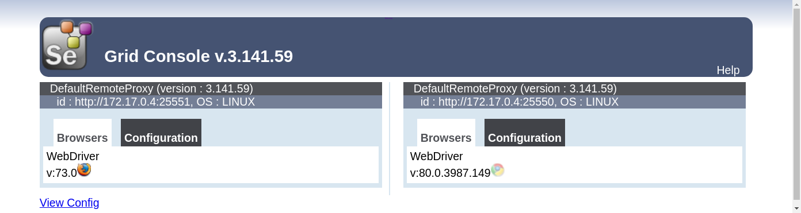

# Selenium in Docker with Chrome and Firefox

[](https://travis-ci.org/elgalu/docker-selenium "Travis CI")
[](https://gitter.im/elgalu/docker-selenium?utm_source=badge&utm_medium=badge&utm_campaign=pr-badge&utm_content=badge "Chat support")
[](https://microbadger.com/images/elgalu/selenium "Docker Badge")

* selenium server grid with 2 nodes (chrome & firefox)
* mkv video recording
* VNC access (useful for debugging the container)
* google-chrome-stable
* google-chrome-beta: no longer provided but [can still be found here][2.47.1m]
* google-chrome-unstable: no longer provided but [can still be found here][2.47.1m]
* firefox stable latest
* firefox stable [last 18 versions can be found here][2.47.1m]
* fluxbox (openbox window manager can still be found [here](https://github.com/elgalu/docker-selenium/releases/tag/3.0.1c))

Selenium 2


Selenium 3


### Purpose
The purpose of this project is to have [Selenium][] running as simple and as fast as possible.

<h2 id="official">Official repo</h2>

Note [SeleniumHQ/docker-selenium](https://github.com/SeleniumHQ/docker-selenium) and this one share the same purpose however both projects have diverged considerably in the last two years, some major differences are:

* both browsers and also the grid are on the same container in this repo
* support for [video recording](./docs/videos.md)
* process manager: this image uses [supervisord](http://supervisord.org) while the official [uses bash](https://github.com/SeleniumHQ/docker-selenium/blob/master/StandaloneChromeDebug/entry_point.sh)

Even though both projects share the same purpose is good to have alternatives, see also for example [docker-alpine-selenium](https://github.com/SUNx2YCH/docker-alpine-selenium). Letting more than 1 docker-selenium project grow to be able to learn from each other's success or failures ultimately impacts the final users positively. This doesn't discard that at some point all selenium maintainers will sit together a sprint to coordinate some major changes and cleanup open issues and perhaps we might merge N similar projects in the future.

### Alternatives
If you don't require a real browser [PhantomJS](https://github.com/ariya/phantomjs) might be enough for you.
[Electron](https://wallabyjs.com/docs/integration/electron.html) allows to use the latest Chromium/V8 which might be equivalent to running in Chrome however still requires a display so [xvfb][xvfb-electron] is needed. You can also use a paid service like [Sauce Labs][sauce] or [BrowserStack][], note they offer free open source accounts and straightforward [integration with Travis CI](https://docs.travis-ci.com/user/sauce-connect/).
You can also configure [xvfb](https://docs.travis-ci.com/user/gui-and-headless-browsers/#Using-xvfb-to-Run-Tests-That-Require-a-GUI) yourself but it involves some manual steps and doesn't include video recording, nor does PhantomJS nor Electron.
A [new chrome --headless feature](https://chromium.googlesource.com/chromium/src/+/master/headless/README.md) looks quite [promising](https://github.com/SeleniumHQ/docker-selenium/issues/370#issuecomment-274810190) so might we worth to take a look though as of now leaves video recording out of scope there and Firefox also out of scope.

### Requisites
This project is normally tested in the last version of Docker and docker-compose and also in the release candidates.
To figure out the currently used specific versions it surely works on,
see file [.travis.yml](./.travis.yml) example values:

    docker --version         #=> 1.13.0
    docker-compose --version #=> 1.10.0

If you need to use docker-machine to run docker
(like for example on a Mac before the Docker native version 1.12),
you also need to install VirtualBox and then run these commands to get started:


```sh
docker-machine create --driver virtualbox default
eval "$(docker-machine env default)"
```

You will need to run the second `eval` command for every new terminal window.

### Usage

<h4 id="run"> Run</h4>

1. Pull the image and run the container

        docker pull elgalu/selenium #upgrades to latest if a newer version is available

        docker run -d --name=grid -p 4444:24444 -p 5900:25900 \
            -e TZ="US/Pacific" --shm-size=1g elgalu/selenium

2. Wait until the grid starts properly before starting the tests _(Optional but recommended)_

        docker exec grid wait_all_done 30s
        # Or if docker exec is not available (eg. circleci)
        wget --retry-connrefused --no-check-certificate -T 30  http://localhost:4444/grid/console -O /dev/null

After this, [Selenium][] will be up and ready to accept clients at `http://localhost:4444/wd/hub`. The grid's available browsers can be viewed by opening the console at `http://localhost:4444/grid/console`.
If you are using Mac (OSX) or [Microsoft Windows](https://docs.docker.com/engine/installation/windows/) `localhost` won't work unless you are in Docker Beta (version >= 1.12) If you are using Docker version <= 1.11 please find out the correct IP through `docker-machine ip default`.

**Notes:**
 * The new default `VNC_PASSWORD=no` will make it VNC passwordless accessible.
 * Once this [docker feature](https://github.com/docker/docker/pull/22719) is in place `wait_all_done` won't be necessary anymore.

#### Stop
Shutdown gracefully

    docker exec grid stop
    docker stop grid

Shutdown immediately, no mercy

    docker rm -vf grid

### Selenium 3
Is now possible to choose Selenium 2 or Selenium 3 via docker run `-e USE_SELENIUM=2` (default) or `-e USE_SELENIUM=3`
Be ready for seeing your tests failing in Firefox.
Please google those errors first before opening an issue in this project.

### e.g. Selenium 2 with FF 47.0.1
```sh
# capabilities['marionette'] = False
docker run --rm -ti --name=grid2 -p 4444:24444 -p 5900:25900 \
  -e USE_SELENIUM=2 \
  --shm-size=1g elgalu/selenium
```

### e.g. Selenium 3 with FF 49.0.1
```sh
# capabilities['marionette'] = True
docker run --rm -ti --name=grid3 -p 4444:24444 -p 5900:25900 \
  -e USE_SELENIUM=3 \
  --shm-size=1g elgalu/selenium
```

### Docker Compose
See [docker-compose](./docs/docker-compose.md)

### Jenkins
See [jenkins](./docs/jenkins.md)

### Parallel
We now have a better suited product for this use case, is called [Zalenium][]

This image is designed to run one test on each docker container but if you still want to run multiple tests in parallel you can still do so with [Zalenium][]

If you want to limit yourself to this project, you still can. There are some ways to do it:

1. The recommended way is via [docker-compose](./docs/docker-compose.md) and you should replace `mock` with your web service under test within the [docker-compose.yml][] file.

        docker-compose -p grid up --force-recreate
        docker-compose -p grid scale mock=1 hub=1 chrome=3 firefox=3

1. The _(not recommended)_ way is by increasing `MAX_INSTANCES` and `MAX_SESSIONS` which now [defaults](https://github.com/elgalu/docker-selenium/blob/2.53.1a/Dockerfile#L967) to 1.

        docker run -d --name=grid -p 4444:24444 -p 5900:25900 \
            --shm-size=1g -e VNC_PASSWORD=hola \
            -e MAX_INSTANCES=20 -e MAX_SESSIONS=20 \
            elgalu/selenium

The drawback is that all tests will run on the same desktop meaning the video recording will only capture the browser in the foreground but it's in the roadmap to make all this transparent, see issues [#78](https://github.com/elgalu/docker-selenium/issues/78) and [#77](https://github.com/elgalu/docker-selenium/issues/77).

Another problem with increasing `MAX_INSTANCES` & `MAX_SESSIONS` is focus issues. So in this case is better scale up/down via [docker-compose](./docs/docker-compose.md).

### OSX
If you are in Mac, you need to get the correct IP of the docker machine. One of these two commands should work to get it:

    docker-machine ip default

or former:

    boot2docker ip

### Screen size
You can set a custom screen size at docker run time by providing `SCREEN_WIDTH` and `SCREEN_HEIGHT` environment variables:

    docker pull elgalu/selenium

    docker run -d --name=grid -p 4444:24444 -p 5900:25900 \
      --shm-size=1g -e VNC_PASSWORD=hola \
      -e SCREEN_WIDTH=1920 -e SCREEN_HEIGHT=1480 \
      elgalu/selenium

    docker exec grid wait_all_done 10s

    open vnc://:hola@localhost:5900

### TimeZone
You can control and modify the timezone on a container by using the [TZ](https://en.wikipedia.org/wiki/List_of_tz_database_time_zones) environment variable through the `docker run` command, e.g. by adding `-e TZ="US/Pacific"`

    docker run --rm -ti --name=grid -p 4444:24444 -p 5900:25900 \
        -e TZ="US/Pacific" -e VNC_PASSWORD=hola \
        --shm-size=1g elgalu/selenium

Examples:

    docker run ... -e TZ="US/Pacific" ...
    docker exec grid date
    #=> Fri May 20 06:04:58 PDT 2016

    docker run ... -e TZ="America/Argentina/Buenos_Aires" ...
    docker exec grid date
    #=> Fri May 20 10:04:58 ART 2016

    docker run ... -e TZ="Europe/Berlin" ...
    docker exec grid date
    #=> Fri May 20 15:04:58 CEST 2016

### Chrome flavor

This feature was available in previous versions, please go to [2.47.1m] to use it.

To configure which Chrome flavor you want to use (stable, beta, unstable), just pass `-e CHROME_FLAVOR=beta` to `docker run`. Default is `stable`.

### Firefox version

This feature was available in previous versions, please go to [2.47.1m] to use it.
To configure which Firefox version to use, first check available versions in the [CHANGELOG](./CHANGELOG.md). Then pass `-e FIREFOX_VERSION=38.0.6` to `docker run`. Default is the latest number of the available list.

<h3 id="video">Record Videos</h3>

Step by step guide at [docs/videos.md](./docs/videos.md)

If you create the container with `-e VIDEO=true` it will start recording a video through the vnc connection run upon start.
It is recommended to create first a local folder `videos` in your current directory, and mount the videos directory for
an easy transfer with `-v $(pwd)/videos:/videos`.

Once your tests are done you can either manually stop the recording via `docker exec grid /bin-utils/stop-video` where
*grid* is just the arbitrary container chosen name in `docker run` command. Or simply stop the container and that will stop the video recording automatically.

Relevant environment variables to customize it are:

    FFMPEG_FRAME_RATE=25
    VIDEO_FILE_NAME="test"
    VIDEO_FILE_EXTENSION=mkv
    FFMPEG_CODEC_ARGS=""

It is important to note that `ffmpeg` video recording takes an important amount of CPU usage, even more when a well compressed format like *mkv* is selected.

### VNC

When you don't specify a VNC password, a random one will be generated. That password can be seeing by grepping the logs:

    docker exec grid wait_all_done 30s
    #=> ... a VNC password was generated for you: ooGhai0aesaesh

You can connect to see what's happening

    open vnc://:ooGhai0aesaesh@localhost:5900

### noVNC

Disabled by default, [noVNC](https://github.com/kanaka/noVNC) provides a browser VNC client so you don't need to install a vnc viewer if you choose so. *Note:* we were using guacamole before.

Safari Browser already comes with a built-in vnc viewer so this feature is overkill and is disabled by default, just navigate to vnc://localhost:5900 in your Safari browser.

You need to pass the environment variable `-e NOVNC=true` in order to start the noVNC service and you will be able to open a browser at [localhost:6080](http://localhost:6080)

    docker run --rm -ti --name=grid -p 4444:24444 -p 5900:25900 \
      --shm-size=1g -p 6080:26080 -e NOVNC=true \
      elgalu/selenium

You can provide additional [NoVNC options](https://github.com/elgalu/noVNC/blob/dosel/app/ui.js#L156) such as `?view_only=false` to allow you to interact with the virtual desktop which now is read-only by default so you don't mess with the tests accidentally.

If the VNC password was randomly generated find out with

    docker exec grid wait_all_done 30s
    #=> ... a VNC password was generated for you: ooGhai0aesaesh

## Issues with Chrome

### Chrome crashed

If your tests crashes in Chrome you may need to increase shm size or simply start your container by sharing `-v /dev/shm:/dev/shm` or, alternatively, `--shm-size=1g`

    docker run ... --shm-size=1g

Alternatively you can increase it inside the container:

1. start docker in privileged mode: `docker run --privileged`
2. increase shm size from default 64mb or 68mb to something bigger:

```sh
docker exec grid sudo umount /dev/shm
docker exec grid sudo mount -t tmpfs -o rw,nosuid,nodev,noexec,relatime,size=512M tmpfs /dev/shm
```

### Chrome not reachable or timeout after 60 secs
In CentOS and apparently since docker 1.10.0 is necessary to disable [sandbox mode](http://www.chromium.org/developers/design-documents/sandbox) through [--no-sandbox](http://peter.sh/experiments/chromium-command-line-switches/#no-sandbox) example client implementation.

The error comes along with this message while starting Chrome:

> Failed to move to new namespace: PID namespaces supported. Network namespace supported, but failed: errno = Operation not permitted

#### No Sandbox

    ChromeOptions options = new ChromeOptions();
    options.addArguments("--no-sandbox");

In Protrator

    capabilities: {
      browserName: 'chrome',
      chromeOptions: {
        args: ['--no-sandbox'],
      },
    },

However this is now the default of this image, see `CHROME_ARGS="--no-sandbox"` in the Dockerfile so don't be surprised to see the "Stability and security will suffer" banner when opening Chrome inside the container.

## Cloud Testing Platforms
We now have a better suited product for this use case, is called [Zalenium][]

## Additional Uses

### Using Xephyr to redirect X to the docker host
Note the below method gives full access to the docker container to the host machine.

Host machine, terminal 1:

    sudo apt-get install xserver-xephyr
    export XE_DISP_NUM=12 SCREEN_WIDTH=2000 SCREEN_HEIGHT=1500
    Xephyr -ac -br -noreset -resizeable \
        -screen ${SCREEN_WIDTH}x${SCREEN_HEIGHT} :${XE_DISP_NUM}

Host machine, terminal 2:

    docker run --rm --name=ch -p=4444:24444 \
      --shm-size=1g \
      -e SCREEN_WIDTH -e SCREEN_HEIGHT -e XE_DISP_NUM \
      -v /tmp/.X11-unix/X${XE_DISP_NUM}:/tmp/.X11-unix/X${XE_DISP_NUM} \
      elgalu/selenium
3
Now when you run your tests instead of connecting. If docker run fails try `xhost +`

## Step by step build

### Build this image
If you git clone this repo locally, i.e. `git clone` it and `cd` into where the Dockerfile is, you can:

    docker build -t selenium .

### Use this image

#### e.g. Spawn a container for Chrome testing:

    CH=$(docker run --rm --name=CH -p=127.0.0.1::24444 -p=127.0.0.1::25900 \
        -v /e2e/uploads:/e2e/uploads selenium)

*Note:* `-v /e2e/uploads:/e2e/uploads` is optional in case you are testing browser uploads on your WebApp, you'll probably need to share a directory for this.

The `127.0.0.1::` part is to avoid binding to all network interfaces, most of the time you don't need to expose the docker container like that so just *localhost* for now.

I like to remove the containers after each e2e test with `--rm` since this docker container is not meant to preserve state, spawning a new one is less than 3 seconds. You need to think of your docker container as processes, not as running virtual machines in case you are familiar with vagrant.

A dynamic port will be bound to the container ones, i.e.

    # Obtain the selenium port you'll connect to:
    docker port $CH 4444
    #=> 127.0.0.1:49155

    # Obtain the VNC server port in case you want to look around
    docker port $CH 25900
    #=> 127.0.0.1:49160

In case you have RealVNC binary `vnc` in your path, you can always take a look, view only to avoid messing around your tests with an unintended mouse click or keyboard.

    ./bin/vncview.sh 127.0.0.1:49160

#### e.g. Spawn a container for Firefox testing:

This command line is the same as for Chrome, remember that the selenium running container is able to launch either Chrome or Firefox, the idea around having 2 separate containers, one for each browser is for convenience, plus avoid certain `:focus` issues your WebApp may encounter during e2e automation.

    FF=$(docker run --rm --name=ff -p=127.0.0.1::24444 -p=127.0.0.1::25900 \
        -v /e2e/uploads:/e2e/uploads selenium)

#### How to get docker internal IP through logs

    CONTAINER_IP=$(docker logs sele10 2>&1 | grep "Container docker internal IP: " | sed -e 's/.*IP: //' -e 's/<.*$//')
    echo ${CONTAINER_IP} #=> 172.17.0.34

#### Look around

    docker images
    #=>

    REPOSITORY  TAG              IMAGE ID      CREATED             SIZE
    selenium    latest           a13d4195fc1f  About an hour ago   2.927 GB
    ubuntu      xenial-20160525  2fa927b5cdd3  4 weeks ago         122 MB

### DNS

#### How to share the host DNS

By default `docker run` sets the DNS to Google ones *8.8.8.8 and 8.8.4.4* however you may need to use your own.

First attempt is to use `--dns` option, e.g.

    docker run --dns=1.1.1.1 --dns=1.1.1.2 <args...>

However this may not work for you and simply want to share the same DNS name resolution than the docker host machine, in which case you should use `--net=host` along with `--pid=host`

    docker run --net=host --pid=host <args...>

So `--pid=host` is included to avoid https://github.com/docker/docker/issues/5899 `sudo: unable to send audit message: Operation not permitted`

##### Pid
Full example using `--net=host` and `--pid=host` but for this to work in OSX you need the latest docker mac package, upgrade if you haven't done so in the last month.

    docker run -d --name=grid --net=host --pid=host \
      --shm-size=1g -e SELENIUM_HUB_PORT=4444 \
      elgalu/selenium
    docker exec grid wait_all_done 30s
    ./test/python_test.py

#### DNS example

    docker run -d --net=host --pid=host --name=grid --shm-size=1g elgalu/selenium
    docker exec grid wait_all_done 30s

## Who is using docker-selenium?

* [Zalando](https://tech.zalando.com/blog/)
* [Shoov](http://www.gizra.com/content/phantomjs-chrome-docker-selenium-standalone/)
* [smaato](http://blog.smaato.com/automated-end-to-end-testing-with-protractor-docker-jenkins)
* [Algolia](https://github.com/algolia/instantsearch.js/#functional-tests)
* [Nvidia](https://twitter.com/nvidia)
* And many more! Please ping @elgalu to add you here.

## Troubleshooting

All output is sent to stdout so it can be inspected by running:

``` bash
$ docker logs -f <container-id|container-name>
```

Powered by Supervisor, the container leaves many logs;

    /var/log/cont/docker-selenium-status.log
    /var/log/cont/selenium-hub-stderr.log
    /var/log/cont/selenium-hub-stdout.log
    /var/log/cont/selenium-node-chrome-stderr.log
    /var/log/cont/selenium-node-chrome-stdout.log
    /var/log/cont/selenium-node-firefox-stderr.log
    /var/log/cont/selenium-node-firefox-stdout.log
    /var/log/cont/selenium-rc-chrome-stderr.log
    /var/log/cont/selenium-rc-chrome-stdout.log
    /var/log/cont/selenium-rc-firefox-stderr.log
    /var/log/cont/selenium-rc-firefox-stdout.log
    /var/log/cont/supervisord.log
    /var/log/cont/video-rec-stderr.log
    /var/log/cont/video-rec-stdout.log
    /var/log/cont/vnc-stderr.log
    /var/log/cont/vnc-stdout.log
    /var/log/cont/xmanager-stderr.log
    /var/log/cont/xmanager-stdout.log
    /var/log/cont/xterm-stderr.log
    /var/log/cont/xterm-stdout.log
    /var/log/cont/xvfb-stderr.log
    /var/log/cont/xvfb-stdout.log

## Security
See [SECURITY.md](./SECURITY.md)

## License
See [LICENSE.md](./LICENSE.md)

<!-- links -->
[2.47.1m]: https://github.com/elgalu/docker-selenium/releases/tag/2.47.1m
[Selenium]: https://github.com/SeleniumHQ/selenium
[sauce]: https://saucelabs.com/selenium/selenium-grid
[BrowserStack]: https://www.browserstack.com/automate
[xvfb-electron]: http://electron.atom.io/docs/tutorial/testing-on-headless-ci
[docker-compose.yml]: ./docker-compose.yml
[Zalenium]: https://github.com/zalando/zalenium
