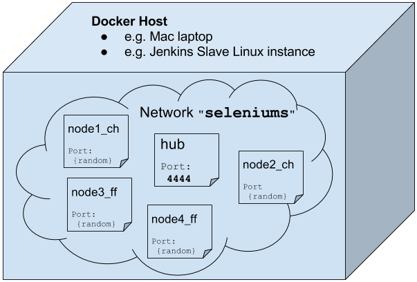
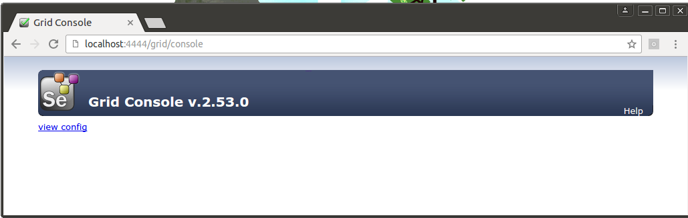
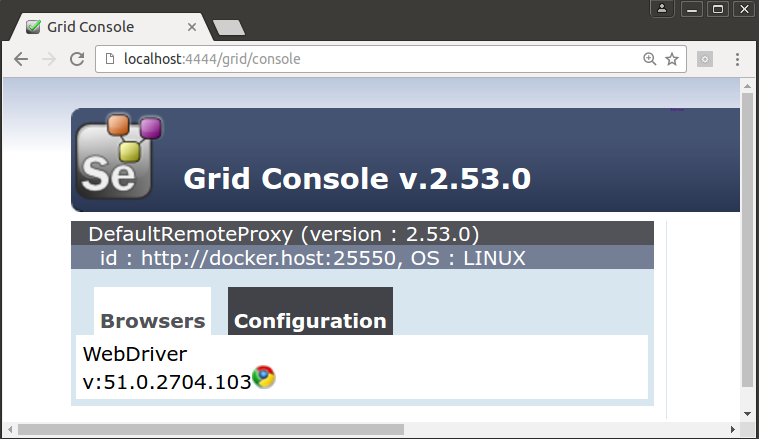
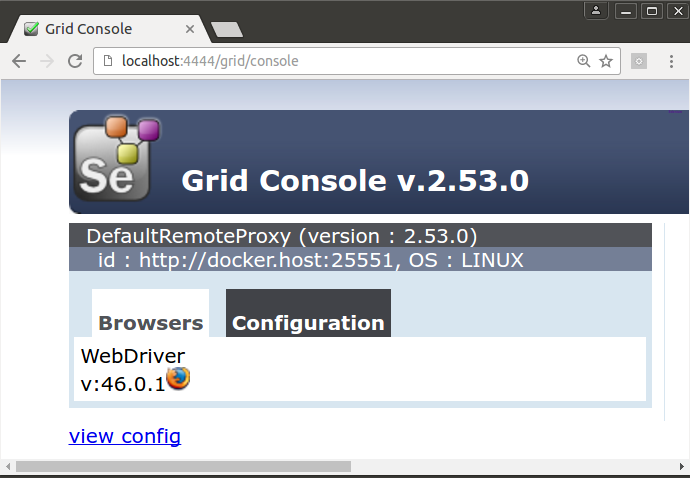

## Grid
You can launch a grid only container via environment variables (deprecated) or using docker's first class citizen networking features (preferred).
*Grid* and *Hub* terms are used interchangeably during this doc.
Note `docker run --link` option is [deprecated](https://docs.docker.com/compose/link-env-deprecated), see `These techniques are cumbersome to set up and prone to error` in docker docs.
So let's use some [docker user-defined networks](https://docs.docker.com/engine/userguide/networking/dockernetworks#user-defined-networks)

## Network
Is better to avoid them and define your own virtual networks instead.
We first create a docker virtual network interface called `seleniums`.
Note the same can be achieved without explicitly creating a network by using `--net:container:hub` but we will not use that technique here.

    docker network create --driver bridge seleniums

This is the diagram showing how the setup will look like:

#### Diagram

> A bridge network is useful in cases where you want to run a relatively small network on a single host.

If you are looking for a more complex multi-hosts setups take a look at the docker [overlay network](https://docs.docker.com/engine/userguide/networking/dockernetworks/#an-overlay-network). An overlay network provides complete isolation for the containers across hosts.

## Hub
Now we attach the Selenium Grid (a.k.a. Hub) to that network interface arbitrary called `seleniums`.
Is important to note `-e CHROME=false -e FIREFOX=false` which tells the docker image not run run default Chrome and Firefox nodes turning the container into a grid-only one.

    docker run -d --name=hub --net=seleniums \
      -e GRID=true -e CHROME=false -e FIREFOX=false \
      -e SELENIUM_HUB_PORT=4444 -p 4444:4444 -e VNC_START=false \
      elgalu/selenium

    docker exec hub wait_all_done 30s

This is how it should look like so far:

## Nodes
Let's add some nodes

### Chrome
Chrome will also attach to the `seleniums` network interface.
The placeholder `{{CONTAINER_IP}}` will be turned into the IP address of the container inside the `seleniums` interface.

    docker run -d --name=node1_ch --net=seleniums \
      -e GRID=false -e CHROME=true -e FIREFOX=false \
      -e VNC_START=false -e PICK_ALL_RANDMON_PORTS=true \
      -e SELENIUM_HUB_PORT=4444 -e SELENIUM_HUB_HOST="hub.seleniums" \
      -e SELENIUM_NODE_HOST="{{CONTAINER_IP}}" \
      --shm-size=1g \
      elgalu/selenium

    docker run -d --name=node2_ch --net=seleniums \
      -e GRID=false -e CHROME=true -e FIREFOX=false \
      -e VNC_START=false -e PICK_ALL_RANDMON_PORTS=true \
      -e SELENIUM_HUB_PORT=4444 -e SELENIUM_HUB_HOST="hub.seleniums" \
      -e SELENIUM_NODE_HOST="{{CONTAINER_IP}}" \
      --shm-size=1g \
      elgalu/selenium

### Firefox
Firefox will also attach to the `seleniums` network interface.

    docker run -d --name=node3_ff --net=seleniums \
      -e GRID=false -e CHROME=false -e FIREFOX=true \
      -e VNC_START=false -e PICK_ALL_RANDMON_PORTS=true \
      -e SELENIUM_HUB_PORT=4444 -e SELENIUM_HUB_HOST="hub.seleniums" \
      -e SELENIUM_NODE_HOST="{{CONTAINER_IP}}" \
      --shm-size=1g \
      elgalu/selenium

    docker run -d --name=node4_ff --net=seleniums \
      -e GRID=false -e CHROME=false -e FIREFOX=true \
      -e VNC_START=false -e PICK_ALL_RANDMON_PORTS=true \
      -e SELENIUM_HUB_PORT=4444 -e SELENIUM_HUB_HOST="hub.seleniums" \
      -e SELENIUM_NODE_HOST="{{CONTAINER_IP}}" \
      --shm-size=1g \
      elgalu/selenium

### Wait
Is convenient to wait for all the nodes to start correctly, also to catch errors before starting the tests in vane:

      docker exec node1_ch wait_all_done 30s
      docker exec node2_ch wait_all_done 30s
      docker exec node3_ff wait_all_done 30s
      docker exec node4_ff wait_all_done 30s

### Finally

This is the final sample grid

This is the docker diagram of that grid

### Cleanup

    docker rm -vf hub node1_ch node2_ch node3_ff node4_ff || true
    docker network rm seleniums || true

## Differences
The difference when using `docker network create` instead of `--net=container:hub` are some:

* unix sockets won't be shared, e.g. `/tmp/.X11-unix/X0`
* `netstat` doesn't report used ports from other containers, this might trigger a race condition (TBD)

## Hub legacy strategy
Legacy connection strategy specifying all ports and host addresses.

    docker run -d --name=hub -e GRID=true -e CHROME=false -e FIREFOX=false \
      -e SELENIUM_HUB_PORT=4444 -p 4444:4444 \
      elgalu/selenium

    docker exec hub wait_all_done 30s

## Node legacy strategy
You can launch a node only container via environment variables.
To enable remote networking access is important to set `SELENIUM_NODE_HOST` as this is the way the Hub (aka Grid) is able to find the node IP addresses.

### Chrome legacy strategy
Port numbers are completely arbitrary, VNC port will be `5940` and Selenium node port will be `25550` in this example.

    docker run -d --name=node_ch -e GRID=false -e CHROME=true -e FIREFOX=false \
      -e SELENIUM_NODE_CH_PORT=25550 -p 25550:25550 \
      -e VNC_PORT=5940 -p=5940:5940 -e VNC_PASSWORD=hola \
      -e SELENIUM_HUB_HOST="{{CONTAINER_IP}}" \
      -e SELENIUM_HUB_PORT=4444 \
      -e SELENIUM_NODE_HOST="{{CONTAINER_IP}}" \
      --shm-size=1g \
      elgalu/selenium && docker exec node_ch wait_all_done 30s

The important part above is `-e GRID=false` which tells the container to be a node-only node, this this case with 2 browsers `-e CHROME=true -e FIREFOX=true` but could be just 1.

Note `SELENIUM_HUB_HOST` and `SELENIUM_NODE_HOST` represent a network firewall config challenge when running on different machines and should be changed to the proper host names or IP addresses of those.

### Firefox legacy strategy
Port numbers are completely arbitrary, VNC port will be `5940` and Selenium node port will be `25550` in this example.

    docker run -d --name=node_ff -e GRID=false -e CHROME=false -e FIREFOX=true \
      -e SELENIUM_NODE_FF_PORT=25551 -p 25551:25551 \
      -e VNC_PORT=5960 -p=5960:5960 -e VNC_PASSWORD=hola \
      -e SELENIUM_HUB_HOST="{{CONTAINER_IP}}" \
      -e SELENIUM_HUB_PORT=4444 \
      -e SELENIUM_NODE_HOST="{{CONTAINER_IP}}" \
      --shm-size=1g \
      elgalu/selenium && docker exec node_ff wait_all_done 30s
