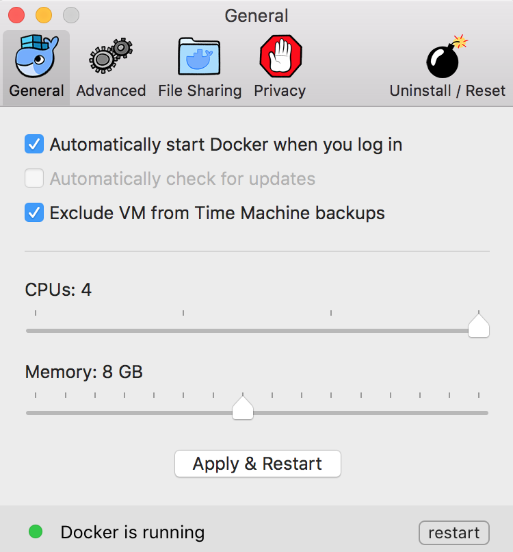

# Make

## Setup
You should replace `mock` with your web service under test within the generated [docker-compose.yml][] file.

    wget -nv https://git.io/vKrBP -O Makefile
    make get setup #first-time

If you want VNC helpers support _(optional)_

    make install_vnc

### OSX
In OSX is convenient to increase the Docker service CPUs and Memory specially if you plan to run more than one Chrome and Firefox at the same time:

## Usage
Make sure to [setup](#setup) first.

### Run
Run spceifying how many nodes you need to run your tests, hopefully in parallel.

    make chrome=5 firefox=4

### VNC
This will open the VNC viewer.

    make see browser=chrome node=1
    make see browser=firefox node=1

### Test
The best way is to run your tests inside your web application under test, in this case is called `mock`

    docker exec -t grid_mock_1 \
      npm test --seleniumUrl="http://localhost:4444/wd/hub"

### Videos
Gather the videos artifacts easily

    make videos

### Cleanup
When done, is convenient to shutdown all the containers.

    make down

## Update
Every now and then you will want to upgrade the script files [.env](../.env), [docker-compose.yml][], [mk/](../mk) and so on.
But given the upgrades are destructive is better to git clone this repository and do `git pull` from time to time.
If you make changes to these config files locally git will advise how to merge latest changes and you will be safe of losing your customizations.

### Git setup
    git clone https://github.com/elgalu/docker-selenium.git

### Git upgrades
    git pull

[docker-compose.yml]: ../docker-compose.yml
